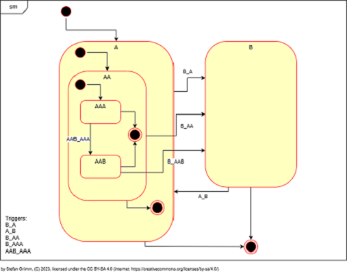

[](https://github.com/mrstefangrimm/TemplateStateMachine/actions/workflows/msbuild.yml)

# Template State Machine

Template State Machine C++ library to to create UML<sup>1</sup> state machines in C++.


By making use of C++ templates, the state machines created with tsm have a smaller memory footprint than state machines using polymorphism (C++ virtual methods or C function pointers).


Some comparisons with other implementations on an Arduino. The example [LED On Off](https://wokwi.com/projects/374516923308308481)  with two states has the smallest memory footprint. The example [Washing Machine](https://wokwi.com/projects/374413481521914881) with five states and a state with sub-states uses 5 more bytes than "LED On Off". QPN is equally good when it comes to dynamic memory, but uses a lot of program space.

| Example sketch | Arduino IDE 2.2.0 |
| -- | -- |
| [LedOnOff (tsm)](https://wokwi.com/projects/374516923308308481) | Sketch uses 2548 bytes (7%) of program storage space. Maximum is 32256 bytes.<br/>Global variables use 207 bytes (10%) of dynamic memory, leaving 1841 bytes for local variables. Maximum is 2048 bytes. |
| [LedOnOff (GOF<sup>2</sup>)](https://wokwi.com/projects/374415929109364737) | Sketch uses 2672 bytes (8%) of program storage space. Maximum is 32256 bytes.<br/>Global variables use 212 bytes (10%) of dynamic memory, leaving 1836 bytes for local variables. Maximum is 2048 bytes. |
| [LedOnOff (qpn<sup>3</sup>)](https://wokwi.com/projects/374416715311795201) | Sketch uses 3976 bytes (12%) of program storage space. Maximum is 32256 bytes.<br/>Global variables use 289 bytes (14%) of dynamic memory, leaving 1759 bytes for local variables. Maximum is 2048 bytes. |
| [Washingmachine (tsm)](https://wokwi.com/projects/374413481521914881) | Sketch uses 2640 bytes (8%) of program storage space. Maximum is 32256 bytes.<br/>Global variables use 212 bytes (10%) of dynamic memory, leaving 1836 bytes for local variables. Maximum is 2048 bytes. |
| [Washing Machine_(qpn)](https://wokwi.com/projects/374417034159644673) | Sketch uses 4404 bytes (13%) of program storage space. Maximum is 32256 bytes.<br/>Global variables use 295 bytes (14%) of dynamic memory, leaving 1753 bytes for local variables. Maximum is 2048 bytes. |

---
[1] UML: Unified Modelling Language. What is covered by tsm is descripted in the section Features. 

[2] GOF: Gang of Four. The state machine is implemented using the design pattern.

[3] QPN: [Quantum Platform Nano](https://github.com/QuantumLeaps/qpn) by Quantum Leaps. The examples where created with the [QM modeler](https://www.state-machine.com/qm/).


### Compatibility

TSM is compatible with the current Arduino tool chain that comes with the Arduino IDE. It requires C++14 or higher and has no dependencies on other libraries.

### Installation

To use tsm in an Arduino sketch, just copy it to Arduino/Libraries and include "tsm.h". Add the tsm/src folder to your includes to use it on other platforms.


## When should you use state machines?

To learn everything about state machines, I recommend the book "Practical UML State Charts is C/C++" by Miro Samek. Also worth watching is [Rise of the State Machines](https://www.youtube.com/watch?v=Zb6xcd2as6o) by Kris Jusiak. I'll leave it at that, otherwise I would just repeat the expert voices.


## When should you use tsm?

You should only use it to experiment with it or for hobby projects at this time. The runtime behavior has not yet been sufficiently tested.

[qpn](https://github.com/QuantumLeaps/qpn) has been around for years and does an excellent job.

While experimenting how I could use C++ templates to generate a state machine, [SML](https://github.com/boost-ext/sml) got released. Too bad for tsm, they  did a great job. It is a pity that SML no longer works with C++14.


## Why should you use tsm?

With tsm, you write state classes with state and behavior. Sounds weird? The opposite of tsm is the [Stateless C# library](https://github.com/dotnet-state-machine/stateless) or [SML](https://github.com/boost-ext/sml). I am not saying state classes are not possible with these libraries, but state classes are not an inherent part of these libraries.

You can define the life cycle model. According to UML, the state object is deleted on exit and created on entry. This can cause memory fragmentation and state objects are usually implemented as Singletons<sup>4</sup>. With tsm you can choose and even write your own memory model.

---

[4] Singleton: Design pattern


## Getting Started

The example with the states A and B is a good starting point. Once you scrolled down to `main` you will see that tsm is easy to use. I recommend to play with it for a while: What happens if you dispatch "B_AA" (to  be read: "to B from AA") when already in B? In what order are the exit methods called when in state AAA and dispatch "B_AA"?

https://wandbox.org/permlink/0RRO72sSNMh2O1nQ

[](https://wandbox.org/permlink/0RRO72sSNMh2O1nQ)[](https://wandbox.org/permlink/0RRO72sSNMh2O1nQ)


The state machine definitions in the above example may seem counterintuitive and scary at first glace.

### Step by step

Define if your state shall be singletons or created with `new` and `delete`. TSM has these pre-defined options:

| Comparator              | Factory          | Description                                                  |
| ----------------------- | ---------------- | ------------------------------------------------------------ |
| MemoryAddressComparator | SingletonCreator | An object is created on the stack for each state.            |
| VirtualTypeIdComparator | FactoryCreator   | An object is created on the heap if a state is entered and destroyed if the stated is exited. The VirtualTypeIdComparator does not require RTTI. The states must implement a `getTypeId()` which return a unique id. |
| RttiComparator          | FactoryCreator   | An object is created on the heap if a state is entered and destroyed if the stated is exited. |

  All states must have the same comparator and factory. 

```C++
// Define the policy, in this case Singlton states
using StatePolicy = State<MemoryAddressComparator, true>;

// Derive your states from SingletonCreator
struct LedOn : public BasicState<LedOn, StatePolicy, true>, SingletonCreator<LedOn> {
  template<class Event>
  void entry(const Event&) {
    BSP_Execute(digitalWrite(LED_BUILTIN, HIGH));
  }
};

struct LedOff : public BasicState<LedOff, StatePolicy, true>, SingletonCreator<LedOff> {
  template<class Event>
  void entry(const Event& ev) {
    BSP_Execute(digitalWrite(LED_BUILTIN, LOW));
  }
};
```


Next is to define the events and the transitions. Events can be empty classes or classes with attributes. Often events are just used to trigger a state change and do not have attributes.

```C++
// Event
struct Timeout {};

// Transitions from LedOn to LedOff and vice versa.
using ToOnFromOff = Transition<Timeout, LedOn, LedOff, NoGuard, NoAction>;
using ToOffFromOn = Transition<Timeout, LedOff, LedOn, NoGuard, NoAction>;
```


Next is the state machine. TSM requires an initial transition, even though this is optional in UML.

```C++
using Transitions =
  Typelist<ToOnFromOff,
  Typelist<ToOffFromOn,
  NullType>>;

// Initial transition to LedOff
using InitTransition = InitialTransition<LedOff, NoAction>;
using Sm = Statemachine<Transitions, InitTransition>;
```


State machines have a `begin()` and an `end()`. Begin triggers the initial transition and end the final transition. Final transitions are required as soon as you have sub-states.

The `setup()` and `loop()` functions round up the step-by-step example:

```C++ 
void setup() {
  pinMode(LED_BUILTIN, OUTPUT);
  statemachine.begin();
}

void loop() {
  statemachine.dispatch<Timeout>();
  delay(1000);  
}
```


 


The states have the methods "entry", "exit" and "do".  States can have sub-states. Transitions have an "action" and a "guard". The state machine has the method "begin" that triggers an initial transition and the method <code>end</code> that calls exit on the current state and its substates.

### Interchangeable memory model

States can be singletons, this is how most implementations work. States can be dynamically created when entered and deleted when exited. Because of memory fragmentation this is not often done.


## License

<a rel="license" href="http://creativecommons.org/licenses/by-sa/4.0/"></a>

This work is licensed under the Creative Commons Attribution-ShareAlike 4.0 International License. To view a copy of this license, visit http://creativecommons.org/licenses/by-sa/4.0/ or send a letter to Creative Commons, PO Box 1866, Mountain View, CA 94042, USA.
